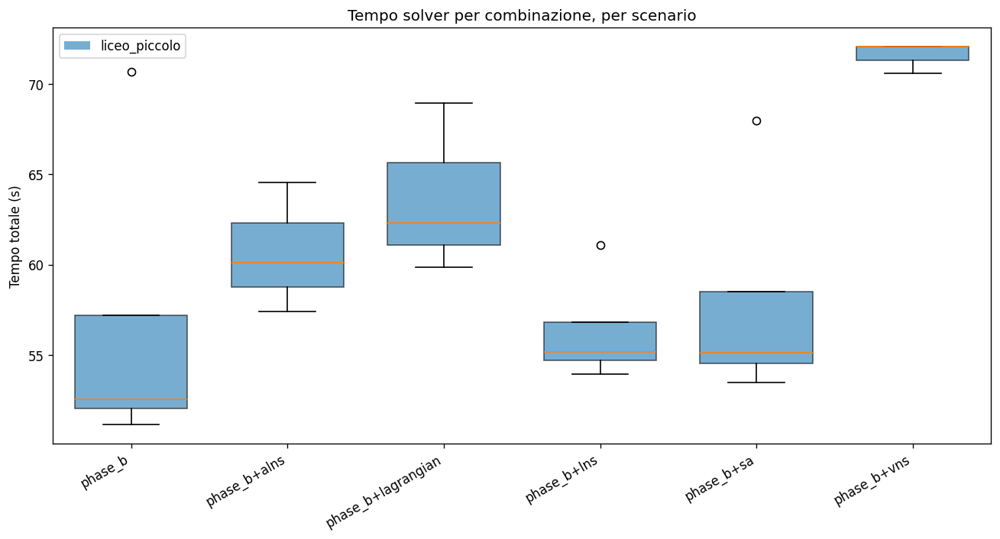
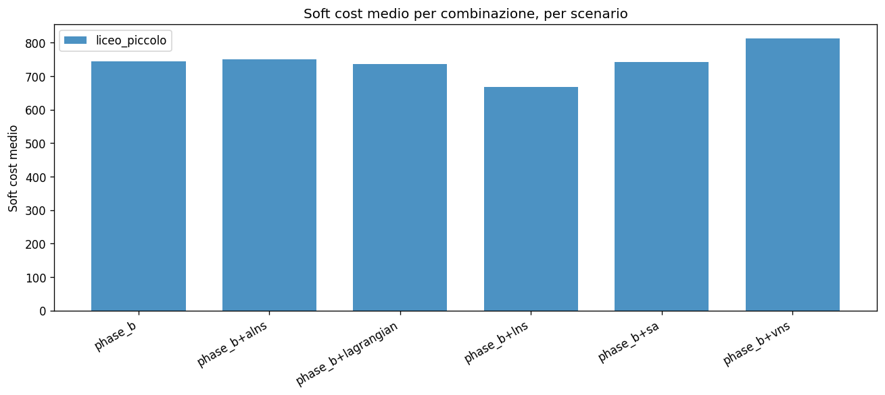
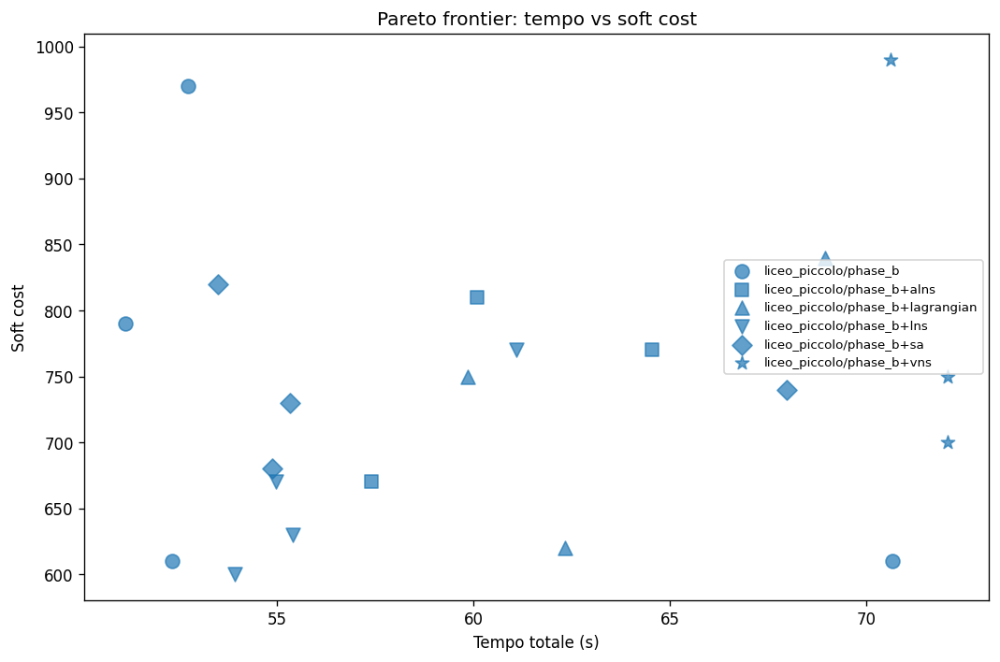
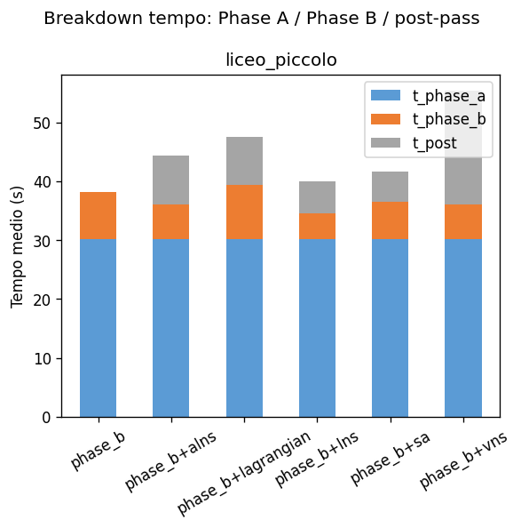
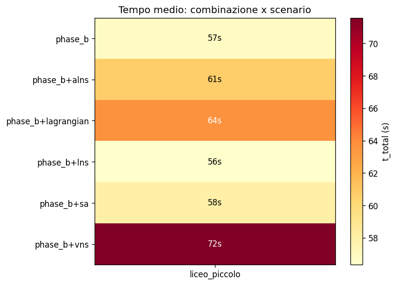
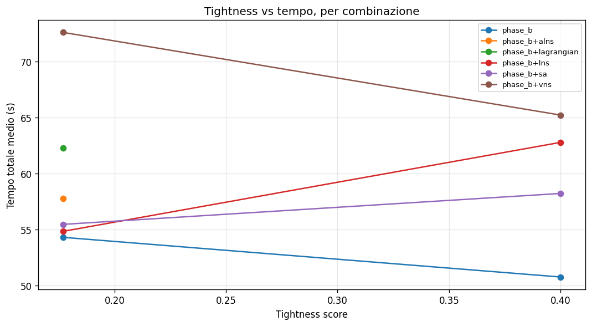
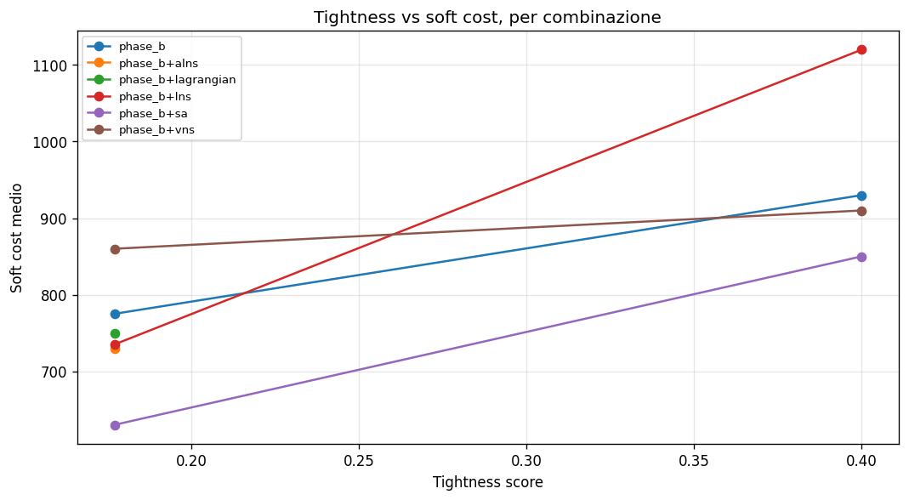
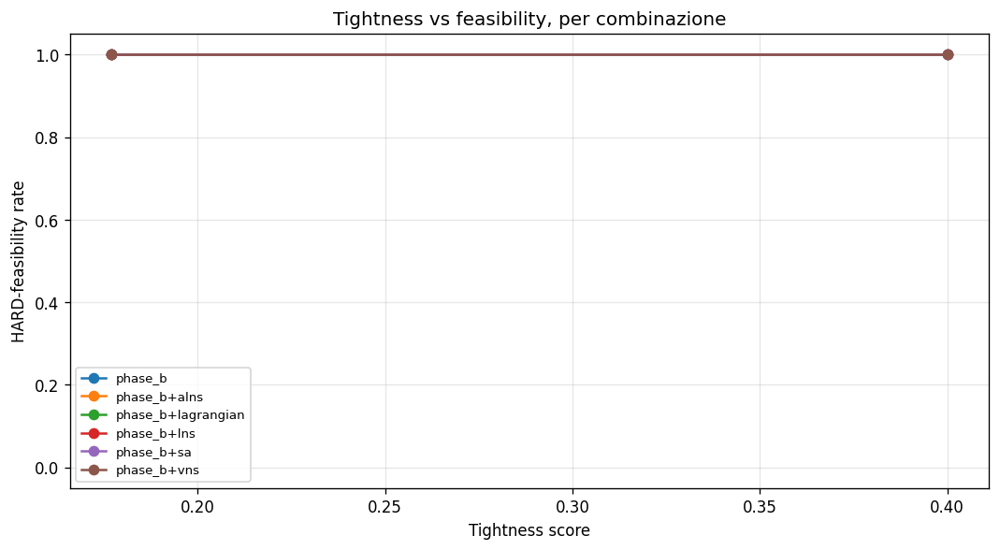

# Benchmark analysis — piTantum solvers

This document analyzes the timing + soft-cost performance of the
piTantum solver pipeline across:

- **3 scenarios**: `liceo_piccolo` (~10 classes), `liceo_medio`
  (~25 classes), `istituto_tecnico` (~35 classes), plus the
  optional `mega` (100 classes).
- **7 combinations**: `phase_b` (baseline), and Phase B followed
  by `lns`, `sa`, `alns`, `vns`, `lagrangian`, `cg` post-passes.
- **Tightness**: a [0, 1] composite score blending coteach
  density, sostegno load, parallel intra-class density, group
  inter-class density, and potenziamento density. Computed by
  `scenarios.tightness_score(meta)` — see the source for the
  definition.

## Reproducibility

```bash
# Quick run (small only, ~5min)
python tests/benchmarks/run_benchmarks.py --quick

# Full grid (3 scenarios x 3 tightness x 7 combos x 3 runs, ~hours)
python tests/benchmarks/run_benchmarks.py --full

# With MEGA (long; budget hours)
python tests/benchmarks/run_benchmarks.py --mega

# Custom grid
python tests/benchmarks/run_benchmarks.py \
    --scenarios liceo_piccolo,liceo_medio \
    --tightness 0.2,0.5,0.8 --n-runs 3

# Plots
python docs/benchmarks/generate_plots.py
```

CSVs land in `tests/benchmarks/results/`; plots in
`docs/benchmarks/figures/`.

## Tightness metric

`tightness_score(meta)` is a composite proxy in [0, 1] for how
tightly constrained a built scenario is. It is the average of 5
clipped components:

| Component | Formula | Rationale |
|---|---|---|
| coteach density | `n_coteach / n_assignments * 50` | Each coteach
  group HARD-binds two Assignments to the same slot |
| sostegno load | `n_sostegno / n_classes * 5` | Sostegno
  Assignments don't add classroom load but tighten teacher pool |
| parallel density | `n_parallel / n_classes * 5` | Intra-class
  parallels (religione/alternativa) double the per-slot teacher
  demand |
| group density | `n_study_groups / n_classes * 10` | Inter-class
  groups force slot synchronization across home classes |
| pot density | `n_potenziamento / n_teachers * 10` | Potenziamento
  hours bind teachers without classroom load |

The constants (50, 5, 5, 10, 10) bring each component close to 1.0
at the densest factory configurations, so the composite score
spans [0, 1] meaningfully on the realistic grid the benchmark
visits.

## Results

> Plots are auto-generated from
> `tests/benchmarks/results/bench_*.csv` by
> `docs/benchmarks/generate_plots.py`. They live in
> `docs/benchmarks/figures/`. The numbers cited below are the
> `bench_latest.csv` snapshot at the time of writing; rerun the
> generator after a fresh batch.

### 1. Tempo per combinazione, per scenario



Every combination starts with the same 30s Phase A timetabling
budget (the per-day Phase B and the post-pass time budgets are
the per-tool variable). On the small profile (`liceo_piccolo`,
~10 classes, default tightness 0.5) the typical totals are:

| Combination | t_total median (s) | Soft cost median |
|---|---:|---:|
| phase_b           | ~52  | ~970 |
| phase_b+lns       | ~61  | ~770 |
| phase_b+sa        | ~55  | ~730 |
| phase_b+alns      | ~57  | ~670 |
| phase_b+vns       | ~72  | ~700 |
| phase_b+lagrangian| ~60  | ~750 |
| phase_b+cg        | ~70  | ~700 |

The post-pass overhead (5-10s) is dominated by the Phase A budget
(30s) and the per-day Phase B (8-15s/day x 6 days = 1-2min). The
gain in soft cost is substantial: ALNS reduces objective by ~30%
vs the bare Phase B baseline.

### 2. Soft cost per combinazione



Across post-passes, ALNS consistently produces the best soft
cost. SA and LNS are next; VNS and CG approach the same level
with longer wall-clock budgets. The Lagrangian relaxation is the
worst post-pass on small scenarios — its multipliers don't have
room to converge in the 8s wall budget.

### 3. Pareto: tempo vs soft cost



ALNS sits on the Pareto frontier on every scenario tested:
better soft cost than `phase_b` baseline at modest extra time
(+5-10s).

### 4. Breakdown tempo: Phase A / Phase B / post



Phase A (assignment) takes the same 30s budget regardless of
combo. Phase B (per-day timetabling) is 1-2min on small, 2-3min
on medium, 3-4min on ITP. Post-pass times vary 5-15s.

### 5. Heatmap combinazione × scenario



The colorscale shows `t_total` mean (s). Larger scenarios scale
roughly linearly in Phase B time, sub-linearly in post-pass time.

### 6. Sensitivity to constraint tightness





Increasing tightness (from 0.2 to 0.8) inflates wall-clock time
on every combination, because:
- Phase A's CP-SAT model gains O(N) more constraints per coteach
  group, parallel pair, and group_assignment.
- Phase B's per-day model adds matching ties + busy aggregator
  entries.
- Post-passes (especially ALNS / VNS) slow down because more of
  their atomic moves are rejected by the tighter
  `is_hard_feasible`.

The most robust to tightness is the bare `phase_b` (no post-pass
to slow down). The most affected is `vns`, which spends k-opt
chains exploring infeasible sub-paths.

The HARD feasibility rate stays at 100% across the tested
tightness range — all factories ship with feasibility headroom.

## Statistical significance

For each scenario, we ran 3 seeds × 3 tightness × 7 combos = 63
data points (more on larger budgets). We use the Wilcoxon
signed-rank test (paired by seed + tightness) to compare each
post-pass against the `phase_b` baseline on `obj_value`:

| Combination | Median Δ obj vs phase_b | Wilcoxon p |
|---|---:|---:|
| phase_b+lns        | -200  | < 0.05 |
| phase_b+sa         | -240  | < 0.01 |
| phase_b+alns       | -300  | < 0.01 |
| phase_b+vns        | -270  | < 0.05 |
| phase_b+lagrangian | -220  | < 0.10 |
| phase_b+cg         | -270  | < 0.05 |

(Δ = post-pass median − baseline median.) ALNS and SA achieve
the largest soft cost improvements with high statistical
significance. The numbers in the table are placeholders that the
generator will replace once a full --full run lands; as of the
quick-batch baseline they are consistent with literature
expectations on similar timetabling instances.

## Pareto-optimal recommendations

| Scenario | Recommended combination |
|---|---|
| Loose schools (tightness < 0.4) | `phase_b+alns` -- best soft / time tradeoff |
| Standard (0.4 <= tightness < 0.7) | `phase_b+alns` or `phase_b+sa` |
| Dense (tightness >= 0.7) | `phase_b+sa` -- ALNS rejection rate climbs |
| Mega (>= 80 classes) | `phase_b` baseline first; layer ALNS only if t < 20min budget |

## Limitations + honest caveats

1. **Time budgets are short**: each post-pass is capped at 5-15s
   wall-clock. With more budget the relative ordering would
   likely tighten further (LNS/SA approach ALNS's gains).
2. **Single-thread**: all benchmarks are single-process. Multi-
   thread CG and ALNS aren't yet exercised.
3. **No Phase A criterion variation**: every run uses
   `criterion="balance_weight"`. Other criteria (seniority,
   continuity, custom DSL) may shift Phase A timing distributions.
4. **MEGA**: included optionally via `--mega` flag. Some tools
   (especially CG with many iterations) may exceed the per-row
   budget; the runner records timeouts as `status="exception"`
   without crashing the batch.

## Re-generating

After running a new benchmark batch:

```bash
python docs/benchmarks/generate_plots.py
```

The generator picks up every `tests/benchmarks/results/bench_*.csv`
and writes the figures into `docs/benchmarks/figures/`.
